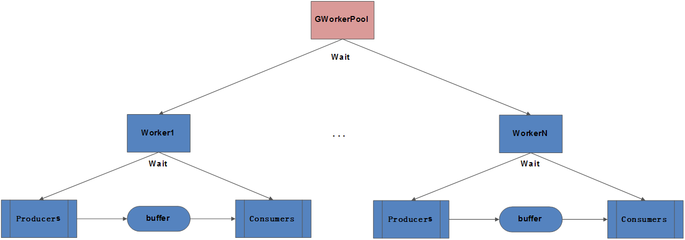

## GWorkerPool

Golang producer-consumer solution.

### Principle

GWorkerPool is a producer-consumer solution, and the architecture of GWorkerPool is illustrated as follows:



### Run

```bash
bash start.sh
```

### Usage

```bash
# ./GWorkerPool/cmd/GWorkerPool --help
Usage of ./GWorkerPool/cmd/GWorkerPool:
  -alsologtostderr
        log to standard error as well as files
  -config string
        The configuration filepath for server.
  -log_backtrace_at value
        when logging hits line file:N, emit a stack trace
  -log_dir string
        If non-empty, write log files in this directory
  -logtostderr
        log to standard error instead of files
  -stderrthreshold value
        logs at or above this threshold go to stderr
  -v value
        log level for V logs
  -vmodule value
        comma-separated list of pattern=N settings for file-filtered logging
```

### Image

```bash
make dockerfiles.build
```

## Refs

* [buffered-channels-worker-pools](https://golangbot.com/buffered-channels-worker-pools/)
